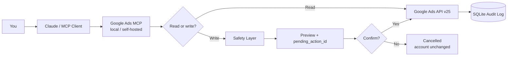

<div align="center">

## 🌐 Choose your language / Elegí tu idioma

[**🇬🇧🇺🇸 English**](README.en.md) · [**🇦🇷🇪🇸 Español**](README.md)

<br>


# Google Ads MCP

### Operate Google Ads from Claude — don't just read it.

**Self-hosted read/write MCP server for Google Ads API v25 with human confirmation, audit logging, MCC isolation, and durable pending actions.**

Built and maintained by **[Alejandro José · Akela](https://github.com/akelaonline)**

[](docs/RELEASE_0.16.8.md)
[](docs/RELEASE_0.16.8.md)
[](https://developers.google.com/google-ads/api)
[](pyproject.toml)
[](LICENSE)

[](https://marketingdigitalexperience.com)
[](https://mktmarketingdigital.com)
[](https://www.instagram.com/akelaonline/)
[](mailto:alejandro@mktmarketingdigital.com)

<br>

[Why it exists](#why-it-exists) · [How it works](#how-it-works) · [Step-by-step tutorial](#step-by-step-tutorial) · [Examples](#real-world-examples) · [Safety](#safety-by-default) · [Capabilities](#capabilities) · [About Akela](#about-akela)

</div>

---

## What this is

**Google Ads MCP** is a [Model Context Protocol](https://modelcontextprotocol.io) server that connects Claude —or any compatible MCP client— to **Google Ads API v25** for real account operations.

It is not designed as another dashboard. It is built for the day-to-day work of agencies and performance teams from a conversation:

- read reports and raw GAQL;
- identify wasted spend;
- create and modify campaigns;
- manage keywords, ads, assets and audiences;
- work with Conversions, Customer Match, Performance Max and Experiments;
- operate multiple accounts through an MCC;
- execute changes with **human-in-the-loop** instead of giving an AI blind control over spend.

Everything runs in your own environment. Your Google Ads credentials do not need to pass through a third-party SaaS middleware.

---

## Why it exists

Reading advertising data with AI is useful. **Operating an account is different.**

Real performance work includes requests like:

> “Show me search terms from the last 7 days, identify queries that spent money without converting, propose negatives, and do not publish anything until I confirm.”

Or:

> “Review this Search campaign, identify where volume was lost to budget, compare CPA, and propose the most reasonable change.”

Or:

> “Build a new campaign structure, leave everything PAUSED, and show me the result before anything can affect delivery.”

Google Ads MCP closes the gap between **analysis** and **action** without removing human control.

### Designed for agencies and operators

| Need | What this MCP provides |
|---|---|
| Many accounts | MCC + allowlist + customer isolation |
| Daily optimization | Report → decision → action in one conversation |
| Consequential changes | `propose → preview → confirm → execute → audit` |
| Auditability | Local SQLite history with action IDs |
| Restarts | Durable encrypted pending actions |
| Reporting-only | Kill switch `GOOGLE_ADS_MCP_READ_ONLY=true` |
| AI integration | Claude Desktop, Claude Code, or any compatible MCP client |

---

## How it works



### A normal write

```text
propose → preview → confirm → execute → audit
```

The AI can prepare the change. **You decide when it executes.**

---

## Real-world examples

### 1. Search Terms → negatives

```text
You:
Review search terms from the last 7 days.
Anything that spent more than USD 20 and had 0 conversions,
propose it as a negative. Do not confirm anything.

Claude:
→ get_search_terms_report(...)
→ add_negative_keywords(...)

Proposal:
- free
- jobs
- diy
- template

pending_action_id: 7f3a2c1e
Nothing changed yet.

You:
Confirm 7f3a2c1e.

Claude:
→ confirm_pending_action("7f3a2c1e")
✓ Change applied and recorded in audit.db
```

### 2. Account audit

```text
Analyze this account for the last 30 days.
Break campaigns down by CPA, ROAS, spend and lost impression share.
Do not make changes. Give me the top 5 priorities first.
```

### 3. Build without publishing

```text
Prepare a Search campaign for this service.
Create the budget, campaign, ad group, keywords and RSA,
but leave everything PAUSED and ask for confirmation before every write.
```

### 4. MCC workflow

```text
List the allowed accounts in my MCC and sort them by spend over the last 7 days.
```

More ready-to-use examples: [`docs/EXAMPLES.md`](docs/EXAMPLES.md).

---

# Step-by-step tutorial

## Step 0 — Requirements

You need:

- Python **3.11+**;
- access to a Google Ads account;
- a Google Ads **Developer Token**;
- OAuth 2.0 Client ID / Client Secret;
- a Refresh Token with Google Ads scope;
- optionally a **Login Customer ID** when using an MCC.

Full credential walkthrough: [`docs/SETUP.md`](docs/SETUP.md).

## Step 1 — Clone and install

```bash
git clone https://github.com/akelaonline/MCP-Google-Ads.git
cd MCP-Google-Ads

python -m venv .venv
source .venv/bin/activate
python -m pip install --upgrade pip
pip install -e ".[dev]"
```

On Windows PowerShell:

```powershell
.venv\Scripts\Activate.ps1
```

## Step 2 — Create your `.env`

```bash
cp .env.example .env
```

Configure at least:

```dotenv
GOOGLE_ADS_DEVELOPER_TOKEN=
GOOGLE_ADS_CLIENT_ID=
GOOGLE_ADS_CLIENT_SECRET=
GOOGLE_ADS_REFRESH_TOKEN=
GOOGLE_ADS_LOGIN_CUSTOMER_ID=
```

For production with several accounts, use an explicit allowlist:

```dotenv
GOOGLE_ADS_MCP_ALLOWED_CUSTOMER_IDS=123-456-7890,987-654-3210
GOOGLE_ADS_MCP_REQUIRE_CUSTOMER_ALLOWLIST=true
```

> **Never commit `.env` to GitHub.**

## Step 3 — Validate the installation

Before opening Claude:

```bash
python scripts/validate_local.py
```

Version 0.16.8 should finish with:

```text
LOCAL VALIDATION GREEN
validated version: 0.16.8
```

The gate runs isolated smoke + Ruff + the full pytest suite. The current reference is **346/346 tests**.

If import fails, first verify that you are using the virtualenv Python:

```bash
.venv/bin/python -c "import google_ads_mcp; print(google_ads_mcp.__version__, google_ads_mcp.__file__)"
```

## Step 4 — Connect Claude Desktop / Claude Code

Use the **absolute path to the virtualenv Python**, not a generic `python`:

```json
{
  "mcpServers": {
    "google-ads": {
      "command": "/absolute/path/MCP-Google-Ads/.venv/bin/python",
      "args": ["-m", "google_ads_mcp.server"],
      "env": {
        "GOOGLE_ADS_MCP_ENV_FILE": "/absolute/path/MCP-Google-Ads/.env"
      }
    }
  }
}
```

Restart the MCP client after changing configuration.

Client guide: [`docs/CLIENTS.md`](docs/CLIENTS.md).

## Step 5 — First test: read-only

Start conservatively:

```dotenv
GOOGLE_ADS_MCP_READ_ONLY=true
```

Then ask:

```text
List my accessible Google Ads customer IDs.
```

Then:

```text
Show campaign performance for the last 7 days.
```

If that works, connection, OAuth and Google Ads access are working without allowing mutations.

## Step 6 — First safe write

When you want to test writes:

```dotenv
GOOGLE_ADS_MCP_READ_ONLY=false
GOOGLE_ADS_MCP_AUTO_APPROVE=false
GOOGLE_ADS_MCP_AUTO_APPROVE_SPEND=false
GOOGLE_ADS_MCP_AUTO_APPROVE_DESTRUCTIVE=false
GOOGLE_ADS_MCP_AUTO_APPROVE_SENSITIVE=false
```

Ask for a reversible change:

```text
Propose renaming this test campaign.
Do not confirm the change.
```

Expect:

```text
status: pending_confirmation
pending_action_id: ...
```

Then choose:

```text
Confirm <pending_action_id>
```

or:

```text
Cancel <pending_action_id>
```

---

## Safety by default

### Read-only kill switch

```dotenv
GOOGLE_ADS_MCP_READ_ONLY=true
```

Reporting, GAQL and audit inspection remain available, while writes and confirmations are blocked.

### MCC / customer isolation

One MCC credential can reach many accounts. The server validates customer IDs and resource references before contacting Google.

It also filters hierarchy surfaces:

- `customer_client`
- `customer_client_link`
- `customer_manager_link`

And inspects cross-customer references even inside protobuf maps, `Struct`, lists and nested messages.

### Risk classes

| Class | Examples | Recommended behavior |
|---|---|---|
| `standard` | preparation/admin without immediate delivery impact | human confirmation |
| `spend` | budget, bidding, keywords, targeting, live assets | mandatory human confirmation |
| `destructive` | remove/unlink | mandatory human confirmation |
| `sensitive` | access, billing, Customer Match, links | mandatory human confirmation |

### Durable pending actions

Pending proposals live in SQLite and replay arguments are encrypted with Fernet.

```dotenv
GOOGLE_ADS_MCP_PENDING_ENCRYPTION_KEY=<fernet-key>
```

If the key is missing or corrupt, the system **fails closed** and does not execute the mutation.

More detail: [`docs/SAFETY.md`](docs/SAFETY.md).

---

## Capabilities

| Domain | Coverage |
|---|---|
| **Accounts & MCC** | discovery, hierarchy, manager/client links, users, roles, invitations |
| **Reporting** | campaigns, ad groups, ads, keywords, search terms, devices, geo, assets, audiences, shopping, impression share, change history, GAQL |
| **Campaigns** | Search, Standard Shopping, Performance Max, Demand Gen, App Campaigns, Dynamic Search Ads, Smart Campaigns |
| **Budgets & bidding** | budgets, Manual CPC, Max Clicks/Conversions/Value, Target CPA/ROAS/Impression Share, portfolio bidding |
| **Ads & assets** | RSA, Responsive Display, Demand Gen, images, video, calls, sitelinks, callouts, snippets, promotions, WhatsApp, lead forms, price, location, app/deep link |
| **Keywords & targeting** | lifecycle, bids, match types, negatives, location/language/device/audience/topic, placements, schedules, tracking URLs |
| **Audiences** | remarketing, UserList, Customer Match, Audience, CustomAudience, CustomInterest |
| **Conversions & goals** | actions, offline/call/enhanced uploads, GDPR consent, adjustments, value rules, unified goals |
| **Performance Max** | campaign + asset groups + assets + signals + listing filters + previews |
| **Experiments** | lifecycle, arms, schedule, promote, graduate, end, traffic splits |
| **Batch / Smart Bidding** | Batch Jobs, seasonality adjustments, data exclusions |
| **Billing & links** | billing setup, invoices, account budgets, ProductLink, DataLink, YouTube/app analytics |
| **Planning / specialist** | Keyword Planner, Reach Planner, Local Services, Identity, Incentives, SKAd visibility, YouTube upload |
| **Access-controlled** | Audience Insights, Benchmarks, Creator Insights, Asset Generation closed beta |

Exhaustive v25 coverage: [`docs/V25_SERVICE_COVERAGE.md`](docs/V25_SERVICE_COVERAGE.md).

---

## Built for agencies and consultants

This project was built for workflows where **marketing, data, and operations need to happen together**.

- Review an MCC without jumping between interfaces.
- Move from report to optimization in the same conversation.
- Prepare complete campaigns and keep everything PAUSED for review.
- Apply negatives from Search Terms without copy/paste.
- Research with Keyword Planner from Claude.
- Operate Conversions, Customer Match, PMax and Experiments.
- Keep a trace of what AI proposed and what a human approved.

It does not replace specialist judgment. **It gives specialists more leverage.**

---

## What makes this project different?

| | Reporting | Read/write management | Human-in-the-loop | Local audit | MCC isolation | Self-hosted |
|---|:---:|:---:|:---:|:---:|:---:|:---:|
| **Google Ads MCP by Akela** | ✅ | ✅ | ✅ | ✅ | ✅ | ✅ |
| Reporting-oriented servers | ✅ | ❌ / partial | — | — | varies | varies |
| Generic SaaS integrators | ✅ | varies | varies | remote | varies | ❌ |

The goal is not to “give an AI total control.” The goal is to **give a human operator real tools through AI**.

---

## Current release — 0.16.8

`0.16.8` is the recommended version.

- Google Ads API v25.
- Isolated smoke green.
- Ruff clean.
- **346/346 pytest**.
- Zero duplicate-tool warnings.
- Canonical tool registration protected by regression coverage.
- Live E2E validated: read-only, cross-customer isolation, propose/cancel, propose/confirm, durable replay after restart.

Technical details —including the registry bug fixed in this release and the canonical owners for Conversion Value Rules / PMax— live in [`docs/RELEASE_0.16.8.md`](docs/RELEASE_0.16.8.md).

Full history: [`CHANGELOG.md`](CHANGELOG.md).

---

## Updating an existing installation

Do not replace your `.env`, audit DB, or encryption key.

```bash
cd MCP-Google-Ads
git fetch origin
git pull --ff-only origin main
source .venv/bin/activate
python -m pip install -e ".[dev]"
python scripts/validate_local.py
```

Full procedure: [`docs/UPDATE_LOCAL.md`](docs/UPDATE_LOCAL.md).

---

## Quick troubleshooting

| Problem | Check first |
|---|---|
| `ModuleNotFoundError: google_ads_mcp` | Claude is using another Python; point to absolute `.venv/bin/python` |
| No accounts appear | OAuth / Developer Token / Login Customer ID |
| `USER_PERMISSION_DENIED` | OAuth identity permissions and correct MCC |
| A write does not execute | it is probably `pending_confirmation` — expected behavior |
| Every write is blocked | check `GOOGLE_ADS_MCP_READ_ONLY=true` |
| Customer blocked | check allowlist; do not widen it without validating the intended account |
| Pending action disappears after restart | persist `audit.db` and the same Fernet key |

Full guide: [`docs/SETUP.md#troubleshooting`](docs/SETUP.md#troubleshooting).

---

## Documentation

| Document | Purpose |
|---|---|
| [`docs/SETUP.md`](docs/SETUP.md) | installation, credentials, OAuth, troubleshooting |
| [`docs/CLIENTS.md`](docs/CLIENTS.md) | Claude Desktop, Claude Code and other MCP clients |
| [`docs/TOOLS.md`](docs/TOOLS.md) | operational tool index |
| [`docs/SAFETY.md`](docs/SAFETY.md) | confirmations, risks, isolation and audit |
| [`docs/EXAMPLES.md`](docs/EXAMPLES.md) | conversations and ready-to-use queries |
| [`docs/V25_SERVICE_COVERAGE.md`](docs/V25_SERVICE_COVERAGE.md) | service-by-service API v25 coverage |
| [`docs/VALIDATION_CHECKLIST.md`](docs/VALIDATION_CHECKLIST.md) | validation before production |
| [`docs/RELEASE_0.16.8.md`](docs/RELEASE_0.16.8.md) | current release |
| [`CHANGELOG.md`](CHANGELOG.md) | complete history |
| [`docs/FAQ.md`](docs/FAQ.md) | frequently asked questions |

---

## About Akela

<div align="center">

### Alejandro José · Akela

**AI Products · WordPress Engineering · SEO Automation · Marketing Technology**

I build practical software where **AI, marketing, advertising, analytics, automation, and real operations** meet.

[](https://marketingdigitalexperience.com)
[](https://mktmarketingdigital.com)
[](https://github.com/akelaonline)

**[Instagram @akelaonline](https://www.instagram.com/akelaonline/)** · **[alejandro@mktmarketingdigital.com](mailto:alejandro@mktmarketingdigital.com)**

> **Build useful things. Ship them. Learn from production.**

If this project saves you time, a ⭐ helps more people find it.

</div>

---

## Scope

This MCP covers **Google Ads API**, not every adjacent Google product.

- Merchant Center feed/catalog editing belongs to Merchant API.
- Google Business Profile is a separate surface.
- Beta/allowlisted services still require Google eligibility.
- `ReservationService` is not public and is not faked.

---

## Contributing

Contributions and issues are welcome: [`CONTRIBUTING.md`](CONTRIBUTING.md).

Main rule: **no write tool may bypass the safety layer**.

---

## License

MIT © 2026 **Alejandro José · Akela**. See [`LICENSE`](LICENSE).
