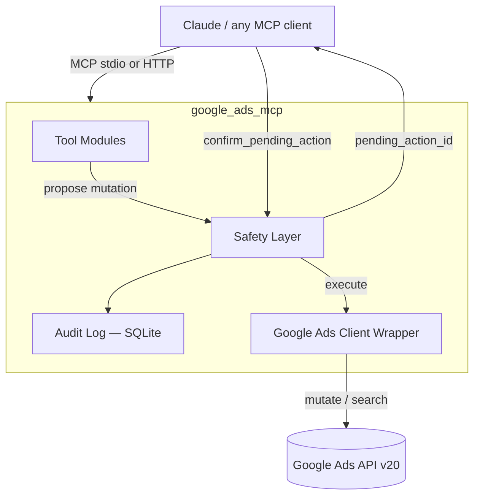

# Google Ads MCP — Full Read/Write Server

**Created and maintained by [Akela](https://github.com/akelaonline)** ([Akelaonline](https://www.youtube.com/@Akelaonline) · [mktmarketingdigital.com](https://mktmarketingdigital.com))

A complete [Model Context Protocol](https://modelcontextprotocol.io) server for **active Google Ads management** — not just reporting. Built on Google's official `google-ads` Python client library, with a human-in-the-loop safety layer so no destructive change ever fires without an explicit confirmation step.

Every other Google Ads MCP server on GitHub today (as of mid-2026) is read-only or partial. This one is built to reach full parity with hands-on account management: campaigns, budgets, ad groups, ads, keywords, negative keywords, bidding strategies, audiences, offline conversions, and account-level change history — all from a single conversational interface.

---

## Why this exists

Most Google Ads MCP servers stop at `search` / `list_accounts` / GAQL reporting. That covers analysis, but not the actual job of running an account: pausing an underperforming ad group at 11pm, pushing a budget increase after a good week, adding negatives from a search-terms report, or shipping a new RSA. This project closes that gap, with safety rails appropriate for real client budgets.

## Architecture



**Two-phase mutation model:** every write tool (`create_*`, `update_*`, `pause_*`, `remove_*`) *proposes* a change and returns a human-readable preview plus a `pending_action_id`. Nothing touches the account until `confirm_pending_action(id)` is called. This mirrors how a careful account manager works — review, then commit — and prevents an LLM from silently spending a client's budget. Set `GOOGLE_ADS_MCP_AUTO_APPROVE=true` in `.env` if you want to skip this for fully automated pipelines (not recommended for accounts with real spend).

Every executed mutation is written to a local SQLite audit log (`audit.db`) with the full before/after payload, so you always have a record of what the agent changed and when.

## Feature coverage

| Domain | Tools |
|---|---|
| **Accounts** | `list_accessible_customers`, `get_account_hierarchy`, `get_account_summary` |
| **Reporting (GAQL)** | `run_gaql_query`, `get_campaign_performance`, `get_ad_group_performance`, `get_keyword_performance`, `get_search_terms_report`, `get_ad_performance` |
| **Campaigns** | `list_campaigns`, `create_campaign`, `update_campaign_status`, `update_campaign_name`, `remove_campaign` |
| **Budgets** | `create_campaign_budget`, `update_campaign_budget` |
| **Bidding** | `set_manual_cpc`, `set_maximize_conversions`, `set_target_cpa`, `set_target_roas` |
| **Ad groups** | `create_ad_group`, `update_ad_group_status`, `update_ad_group_cpc_bid` |
| **Ads** | `create_responsive_search_ad`, `update_ad_status`, `remove_ad` |
| **Keywords** | `add_keywords`, `update_keyword_status`, `remove_keyword`, `add_negative_keywords` (campaign or ad-group level) |
| **Audiences** | `list_user_lists`, `attach_audience_to_ad_group` |
| **Conversions** | `list_conversion_actions`, `upload_offline_conversion` |
| **Change history** | `get_change_history` (last 30 days, native `change_event` resource) |
| **Safety** | `list_pending_actions`, `confirm_pending_action`, `cancel_pending_action` |

~40 tools total. See [`docs/TOOLS.md`](docs/TOOLS.md) for full parameter reference.

## Documentation

- [`docs/SETUP.md`](docs/SETUP.md) — step-by-step: Cloud project, OAuth client, developer token, refresh token, first smoke test.
- [`docs/TOOLS.md`](docs/TOOLS.md) — every tool, its arguments, and what it does.
- [`docs/SAFETY.md`](docs/SAFETY.md) — how the propose/confirm layer and audit log work, and why.
- [`docs/EXAMPLES.md`](docs/EXAMPLES.md) — sample conversations and useful raw GAQL queries.

## Setup

### 1. Requirements
- Python 3.11+
- A Google Ads **Developer Token** with at least Standard access ([apply here](https://developers.google.com/google-ads/api/docs/get-started/dev-token)) — Basic/Test tokens can only read test accounts.
- OAuth2 credentials (Desktop App type) or a service account with domain-wide delegation.

### 2. Install

```bash
git clone https://github.com/akelaonline/MCP-Google-Ads.git
cd MCP-Google-Ads
python -m venv .venv && source .venv/bin/activate
pip install -e .
```

### 3. Configure

```bash
cp .env.example .env
```

Fill in:

```
GOOGLE_ADS_DEVELOPER_TOKEN=...
GOOGLE_ADS_CLIENT_ID=...
GOOGLE_ADS_CLIENT_SECRET=...
GOOGLE_ADS_REFRESH_TOKEN=...
GOOGLE_ADS_LOGIN_CUSTOMER_ID=...      # optional, only for MCC access
GOOGLE_ADS_MCP_AUTO_APPROVE=false     # keep false unless you know what you're doing
```

Don't have a refresh token yet? Run:

```bash
python -m google_ads_mcp.auth --generate-refresh-token
```

This opens the OAuth consent screen and prints the refresh token to paste into `.env`.

### 4. Register with your MCP client

**Claude Desktop / Claude Code** (`~/.claude/settings.json` or `claude_desktop_config.json`):

```json
{
  "mcpServers": {
    "google-ads": {
      "command": "python",
      "args": ["-m", "google_ads_mcp.server"],
      "env": { "GOOGLE_ADS_MCP_ENV_FILE": "/absolute/path/to/.env" }
    }
  }
}
```

**HTTP transport** (for shared/remote use):

```bash
python -m google_ads_mcp.server --transport http --port 8080
```

## Safety model in practice

```
> Pause the "Brand - Search" campaign for customer 123-456-7890

Claude calls update_campaign_status(...)
→ "Proposed: set campaign 'Brand - Search' (id 111222333) status
   ENABLED → PAUSED. Nothing has been changed yet.
   pending_action_id: 7f3a2c1e"

> confirm

Claude calls confirm_pending_action("7f3a2c1e")
→ "Done. Campaign 'Brand - Search' is now PAUSED. Logged to audit.db."
```

## License

MIT © 2026 [Akela](https://github.com/akelaonline). See [LICENSE](LICENSE).

Contributions welcome — see [CONTRIBUTING.md](CONTRIBUTING.md). If this saves you time, a ⭐ on the repo is the best thank-you.
