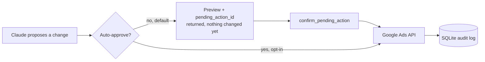

<div align="center">

# Google Ads MCP

**Full read/write [Model Context Protocol](https://modelcontextprotocol.io) server for active Google Ads management from Claude.**

Built by [**Akela**](https://github.com/akelaonline)

[](LICENSE)
[](pyproject.toml)
[](https://developers.google.com/google-ads/api)
[](tests/)
[](CHANGELOG.md)

[Quick start](#quick-start) · [What it does](#what-it-does) · [Safety model](#safety-model) · [Documentation](#documentation) · [Changelog](CHANGELOG.md) · [FAQ](docs/FAQ.md)

</div>

---

## Why this exists

Most Google Ads MCP servers on GitHub today stop at reporting: `search`, `list_accounts`, raw GAQL. That's useful for analysis, but it isn't what running an account actually requires — pausing an ad group that's bleeding budget, shipping a new Responsive Search Ad, adding negatives from this week's search-terms report, or nudging a budget after a strong week.

This server closes that gap. It's built on Google's **official `google-ads` Python client** (API v20), wraps ~40 tools spanning the full campaign lifecycle, and adds a **human-in-the-loop safety layer** so an LLM never silently touches real client spend — every write is proposed, previewed, and only executes on explicit confirmation.

## What it does

| Domain | Capabilities |
|---|---|
| **Accounts** | List accessible customers, walk MCC hierarchies, pull account summaries |
| **Reporting** | Campaign / ad group / keyword / ad / search-term performance, change history, and open-ended GAQL |
| **Campaigns** | Create, rename, pause/enable, remove — any channel type |
| **Budgets** | Create and adjust daily budgets |
| **Bidding** | Manual CPC, Maximize Conversions, Target CPA, Target ROAS |
| **Ad groups** | Create, pause/enable, adjust CPC bids |
| **Ads** | Create Responsive Search Ads, pause/enable/remove |
| **Keywords** | Add (with match type + bid), pause/enable/remove, negatives at campaign or ad-group level |
| **Audiences** | List and attach user lists to ad groups with bid modifiers |
| **Conversions** | List conversion actions, upload offline conversions (built for CRM/WhatsApp-driven funnels) |

Full parameter-level reference: [`docs/TOOLS.md`](docs/TOOLS.md).

## Safety model



Every write tool — anything named `create_*`, `update_*`, `remove_*`, `set_*`, `add_*`, `upload_*` — proposes the change instead of executing it. Nothing touches the live account until `confirm_pending_action(action_id)` is called. Proposals expire after 30 minutes by default. Every executed mutation is logged to a local SQLite audit trail with the full before/after payload.

Full write-up: [`docs/SAFETY.md`](docs/SAFETY.md).

## Quick start

```bash
git clone https://github.com/akelaonline/MCP-Google-Ads.git
cd MCP-Google-Ads
python -m venv .venv && source .venv/bin/activate
pip install -e .
cp .env.example .env   # fill in credentials — see docs/SETUP.md
```

**Verify the install before doing anything else** (this catches the #1 support issue — an incomplete or corrupted virtualenv — before it costs you a debugging session):

```bash
.venv/bin/python -c "import google_ads_mcp; print('OK:', google_ads_mcp.__file__)"
```

If that doesn't print `OK: ...`, don't try to patch it — nuke and rebuild the venv, it's faster than debugging a half-installed one:

```bash
rm -rf .venv
python -m venv .venv
.venv/bin/python -m pip install -e .
```

> **Point your MCP config at the venv's own Python (an absolute path), not a bare `python`.** Claude Desktop launches the server with its own `PATH`, which may not resolve to the virtualenv you just created — this is the most common cause of a server that works fine when you run it by hand but shows as "failed" inside Claude. If you still hit issues, see the [venv troubleshooting entry](docs/SETUP.md#troubleshooting) — it covers a specific corruption pattern (duplicated `.venv` files with a `" 2"` suffix, from a macOS Finder folder merge) that causes `ModuleNotFoundError` intermittently.

Register with Claude Desktop / Claude Code (`~/.claude/settings.json` or `claude_desktop_config.json`) — point `command` at the venv's own Python, not a bare `python`:

```json
{
  "mcpServers": {
    "google-ads": {
      "command": "/absolute/path/to/MCP-Google-Ads/.venv/bin/python",
      "args": ["-m", "google_ads_mcp.server"],
      "env": { "GOOGLE_ADS_MCP_ENV_FILE": "/absolute/path/to/.env" }
    }
  }
}
```

Restart Claude and try: *"List my accessible Google Ads customer IDs."*

Need the Developer Token / OAuth client / refresh token first? Full walkthrough in [`docs/SETUP.md`](docs/SETUP.md). Something not working? Check [`docs/SETUP.md#troubleshooting`](docs/SETUP.md#troubleshooting) first — most install issues are already diagnosed there. See what changed recently in [`CHANGELOG.md`](CHANGELOG.md).

## Example

```
> Pull the search terms report for customer 123-456-7890, last 7 days.
  Anything with cost over $20 and zero conversions, add as negatives.

Claude → get_search_terms_report(...)
       → add_negative_keywords(...)
       ← "Proposed: add 4 negative keywords to campaign 111222333:
          [BROAD] free, [BROAD] jobs, [BROAD] diy, [BROAD] template
          pending_action_id: 7f3a2c1e — nothing changed yet."

> confirm

Claude → confirm_pending_action("7f3a2c1e")
       ← "Done. 4 negatives added. Logged to audit.db."
```

More flows and ready-to-use GAQL queries: [`docs/EXAMPLES.md`](docs/EXAMPLES.md).

## Documentation

| Doc | Covers |
|---|---|
| [`CHANGELOG.md`](CHANGELOG.md) | What changed in each version — check here after `git pull` before reporting a bug |
| [`docs/SETUP.md`](docs/SETUP.md) | Cloud project, OAuth client, developer token, refresh token, smoke test, troubleshooting table |
| [`docs/TOOLS.md`](docs/TOOLS.md) | Every tool, its arguments, and what it returns |
| [`docs/SAFETY.md`](docs/SAFETY.md) | How propose/confirm and the audit log work, and why |
| [`docs/EXAMPLES.md`](docs/EXAMPLES.md) | Sample conversations and useful raw GAQL queries |
| [`docs/FAQ.md`](docs/FAQ.md) | 40 real questions — from "where do I get the token" to "why not use an existing server" |

## How this compares

| | Read reports | Write / manage | Human-in-the-loop | Audit log | Self-hosted, no third party |
|---|:---:|:---:|:---:|:---:|:---:|
| **This project** | ✅ | ✅ | ✅ | ✅ | ✅ |
| Official `googleads/google-ads-mcp` | ✅ | ❌ | — | — | ✅ |
| Most community servers | ✅ | Partial | ❌ | ❌ | ✅ |
| Hosted/paid aggregators | ✅ | Varies | ❌ | ❌ | ❌ |

## Requirements

- Python 3.11+
- A Google Ads **Developer Token** with Standard access for production use ([apply here](https://developers.google.com/google-ads/api/docs/get-started/dev-token) — Test access works for building/testing against test accounts)
- OAuth 2.0 credentials (Desktop app) — see [`docs/SETUP.md`](docs/SETUP.md)

## Contributing

Contributions welcome — see [`CONTRIBUTING.md`](CONTRIBUTING.md). The one hard rule: every write tool goes through the safety layer (`ctx.safety.propose(...)`), never a direct mutate call.

## License

MIT © 2026 [Akela](https://github.com/akelaonline). See [LICENSE](LICENSE).

If this saves you time, a ⭐ on the repo is appreciated.
