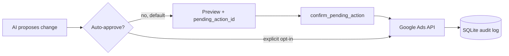

<div align="center">

# Google Ads MCP

**Read/write Model Context Protocol server for operating Google Ads accounts from an AI client — with explicit confirmation, audit logging, and Google Ads API v25 contracts.**

Built by [**Akela**](https://github.com/akelaonline) — Google Ads automation & AI workflows

[](mailto:adjose@gmail.com)
[](https://www.instagram.com/akelaonline/)
[](LICENSE)
[](pyproject.toml)
[](https://developers.google.com/google-ads/api)
[](https://github.com/akelaonline/MCP-Google-Ads/actions/workflows/tests.yml)
[](CHANGELOG.md)

[Quick start](#quick-start) · [Capabilities](#capabilities) · [Safety](#safety-by-default) · [v0.12 hardening](#v012-compatibility--hardening) · [Documentation](#documentation)

</div>

---

## What this is

Most Google Ads MCP servers stop at reporting and raw GAQL. This project is designed to **operate** accounts: inspect performance, create and edit campaigns, change budgets and bidding, manage keywords and negatives, work with assets and audiences, upload offline conversions, build Performance Max structures, run experiments, and apply or dismiss recommendations.

Every normal write follows a **propose → preview → confirm → execute → audit** flow. The default configuration does not silently change live spend.

## v0.12 compatibility & hardening

v0.12 is a compatibility and reliability release, not a feature-expansion release. It moves the server onto the current **Google Ads API v25** contract and removes legacy API assumptions that could previously pass unit tests but fail against the real Google client.

Key changes:

- Google Ads Python client pinned to the tested 31.x line and API version fixed to `v25`.
- Campaign creation uses v25 date-time fields and the required EU political-advertising declaration.
- Removed legacy Call Ad usage. `create_call_ad` is retained as a compatibility tool and now builds **RSA + Call Asset** atomically.
- Removed legacy Message Asset usage. `create_message_asset` now creates a **Business Message / WhatsApp** asset.
- RSA creative edits use `AdService` / `AdOperation`.
- Performance Max campaign bidding and AssetGroup creation follow the v25 structure; complete non-retail asset groups are created atomically with their required assets.
- Legacy Local and Smart Shopping creation paths are refused explicitly instead of sending obsolete mutations. Use Performance Max for those modern workflows.
- Multi-resource create/link flows use `GoogleAdsService.Mutate` where atomic behavior matters, preventing orphan assets after partial failures.
- Website remarketing creates a real URL rule instead of treating an empty rule as “all visitors”.
- Offline click uploads verify that the conversion action is `UPLOAD_CLICKS` and enabled before submission.
- Enhanced-conversion identifiers are normalized and hashed locally before upload.
- Conversion primary/secondary behavior uses mutable `primary_for_goal`, not the immutable legacy counting field.
- Language/device targeting setters are idempotent rather than blindly creating duplicate criteria.
- Bulk write tools are all-or-nothing by default instead of silently succeeding after partial failures.
- Remote image fetches reject private/loopback/link-local destinations, unsafe schemes, redirects to private networks, unsupported MIME types, and oversized files.
- Unauthenticated HTTP transport is blocked by default. `stdio` remains the recommended local transport.
- Pending actions survive transient execution failures and keep the same action ID through retry and audit history.
- CI now includes **real generated v25 protobuf contract tests**, not only permissive fakes.

## Capabilities

| Domain | Capabilities |
|---|---|
| **Accounts & MCC** | Accessible customers, account hierarchy, summaries, create client accounts, manager-link acceptance |
| **Reporting** | Campaign, ad group, keyword, ad, search term, device, geography, asset, audience, quality score, disapproval, shopping and change-history reports; raw GAQL fallback |
| **Campaigns** | Create, rename, pause/enable/remove; Search and other supported generic channels; Standard Shopping; Performance Max; Demand Gen; experiments |
| **Budgets** | Create and update daily/shared budgets |
| **Bidding** | Manual CPC, Maximize Clicks, Maximize Conversions, Maximize Conversion Value, Target CPA/ROAS, Target Impression Share, portfolio strategies |
| **Ad groups** | Campaign-aware creation, status changes, CPC updates |
| **Ads** | Responsive Search, Responsive Display, Video and Demand Gen creatives; RSA edits; legacy Call Ad compatibility via RSA + Call Asset |
| **Assets** | Sitelinks, calls, images, promotions, callouts, structured snippets, Business Message / WhatsApp; attach/detach |
| **Keywords** | Add, bid updates, match-type recreation, pause/enable/remove, campaign/ad-group negatives, bulk operations |
| **Keyword research** | Keyword ideas and historical metrics through Keyword Planner |
| **Audiences** | Website remarketing rules, Customer Match, affinity/in-market, topics, attach/detach |
| **Targeting** | Live geo resolution, languages, schedules, device modifiers, placement exclusions |
| **Conversions** | List/create actions, offline click uploads, enhanced conversions, primary/secondary behavior, value rules |
| **Recommendations** | List active/dismissed recommendations, apply, dismiss |
| **Performance Max** | Campaigns, complete asset groups, text/image/video assets, listing filters, audience/search-theme signals |
| **Experiments** | System-managed experiment setup, arm inspection, promotion and ending |

Full signatures and operational notes live in [`docs/TOOLS.md`](docs/TOOLS.md).

## Safety by default


```mermaid
flowchart LR
    A[AI proposes change] --> B{Auto-approve?}
    B -- no, default --> C[Preview + pending_action_id]
    C --> D[confirm_pending_action]
    D --> E[Google Ads API]
    B -- explicit opt-in --> E
    E --> F[(SQLite audit log)]
```

Writes are proposed first unless `GOOGLE_ADS_MCP_AUTO_APPROVE=true` is explicitly configured. A pending action expires after 30 minutes by default.

If Google or the network fails during confirmation, the action **stays pending** and can be retried with the same ID. The audit log records failed and successful attempts under that same action ID.

For real-spend accounts, keep auto-approve disabled.

See [`docs/SAFETY.md`](docs/SAFETY.md).

## Quick start

```bash
git clone https://github.com/akelaonline/MCP-Google-Ads.git
cd MCP-Google-Ads
python -m venv .venv
source .venv/bin/activate
pip install -e .
cp .env.example .env
```

Fill in:

```dotenv
GOOGLE_ADS_DEVELOPER_TOKEN=
GOOGLE_ADS_CLIENT_ID=
GOOGLE_ADS_CLIENT_SECRET=
GOOGLE_ADS_REFRESH_TOKEN=
GOOGLE_ADS_LOGIN_CUSTOMER_ID=
```

Generate a refresh token if needed:

```bash
pip install -e ".[auth]"
python -m google_ads_mcp.auth --generate-refresh-token
```

Verify the install:

```bash
.venv/bin/python -c "import google_ads_mcp; print('OK', google_ads_mcp.__version__, google_ads_mcp.__file__)"
```

Register the MCP with Claude Desktop / Claude Code. Point to the virtualenv Python by absolute path:

```json
{
  "mcpServers": {
    "google-ads": {
      "command": "/absolute/path/to/MCP-Google-Ads/.venv/bin/python",
      "args": ["-m", "google_ads_mcp.server"],
      "env": {
        "GOOGLE_ADS_MCP_ENV_FILE": "/absolute/path/to/MCP-Google-Ads/.env"
      }
    }
  }
}
```

Restart the MCP client and try:

> List my accessible Google Ads customer IDs.

Detailed credential and OAuth setup: [`docs/SETUP.md`](docs/SETUP.md).

## Example: report → proposed action → confirmation

```text
User: Pull search terms for the last 7 days. Anything expensive with zero
      conversions, propose campaign negatives.

AI -> get_search_terms_report(...)
AI -> add_negative_keywords(...)
   <- pending_confirmation
      pending_action_id: 7f3a2c1e...
      nothing changed yet

User: confirm

AI -> confirm_pending_action("7f3a2c1e...")
   <- executed and recorded in the audit log
```

## HTTP transport

`stdio` is the default and recommended transport for local MCP clients.

The project intentionally **blocks HTTP startup by default** because write and confirmation tools are powerful and the server does not bundle a remote identity provider. If you deliberately deploy behind your own authenticated/restricted reverse proxy, you must explicitly opt in:

```dotenv
GOOGLE_ADS_MCP_TRANSPORT=http
GOOGLE_ADS_MCP_ALLOW_INSECURE_HTTP=true
```

Do not expose an unauthenticated instance to the public Internet.

## Important scope boundaries

This MCP wraps the **Google Ads API**, not every adjacent Google advertising product.

- Merchant Center product/feed management remains outside this server. Shopping/PMax retail campaigns expect an already linked Merchant Center setup.
- Google Business Profile linking is separate from campaign operations.
- Legacy Local Campaign and Smart Shopping creation are intentionally not emulated on obsolete API shapes; use Performance Max workflows.
- Old Call Ads are represented by the supported RSA + Call Asset replacement.

## Tests

CI runs on Python **3.11, 3.12 and 3.13** and includes:

- installation smoke test;
- unit tests for MCP behavior and safety;
- source guardrails preventing removed API patterns from returning;
- real `google-ads` **v25 generated protobuf contract tests** for critical write paths.

Run locally:

```bash
pip install -e ".[dev]"
pytest tests/ -v
ruff check src tests scripts
```

## Documentation

| Doc | Purpose |
|---|---|
| [`CHANGELOG.md`](CHANGELOG.md) | Release history and migration notes |
| [`docs/SETUP.md`](docs/SETUP.md) | Google Cloud, OAuth, Developer Token, MCP config, troubleshooting |
| [`docs/TOOLS.md`](docs/TOOLS.md) | Tool signatures and operational notes |
| [`docs/SAFETY.md`](docs/SAFETY.md) | Confirmation, retries, audit trail, HTTP safety |
| [`docs/EXAMPLES.md`](docs/EXAMPLES.md) | Example workflows and GAQL patterns |
| [`docs/FAQ.md`](docs/FAQ.md) | Common questions |

## Contributing

See [`CONTRIBUTING.md`](CONTRIBUTING.md). The non-negotiable rule for write tools is: **they must go through the safety layer**. Multi-resource operations that must succeed together should use the atomic mutation path.

## About Akela

I help agencies and consultants automate Google Ads workflows with AI — from MCC reporting to campaign builds, optimization, experiments, and custom MCP integrations.

- **Email:** [adjose@gmail.com](mailto:adjose@gmail.com)
- **Instagram:** [@akelaonline](https://www.instagram.com/akelaonline/)
- **GitHub:** [akelaonline](https://github.com/akelaonline)

If this saves you time, a ⭐ on the repo is appreciated.

## License

MIT © 2026 [Akela](https://github.com/akelaonline). See [LICENSE](LICENSE).
