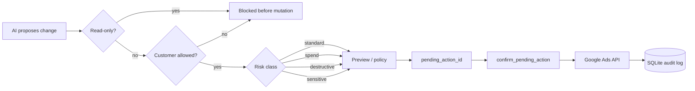

<div align="center">

# Google Ads MCP

**Production-grade read/write Model Context Protocol server for Google Ads API v25.**

Operate Google Ads from an AI client with explicit confirmation, SQLite audit,
durable encrypted pending actions, MCC/customer isolation, a hard read-only mode,
and broad v25 service coverage.

Built by [**Akela**](https://github.com/akelaonline) — Google Ads automation & AI workflows

[](LICENSE)
[](pyproject.toml)
[](https://developers.google.com/google-ads/api)
[](docs/RELEASE_0.16.0.md)

[Quick start](#quick-start) · [Capabilities](#capabilities) · [Safety](#safety-by-default) · [Production](#production-deployment) · [Coverage](docs/V25_SERVICE_COVERAGE.md) · [Docs](#documentation)

</div>

---

## What this is

Google Ads MCP is designed to **operate** Google Ads accounts, not only report on them.

It can inspect performance, create and edit campaigns, change budgets and bidding,
manage ads/keywords/assets/audiences, administer MCC relationships and user access,
work with conversions and goals, operate Performance Max and Smart Campaigns,
manage experiments, upload Customer Match/conversion data, work with billing/product
links, and call specialist planning/insight services exposed by Google Ads API v25.

Every normal write follows:

```text
propose -> preview -> confirm -> execute -> audit
```

The default configuration does **not** silently change live spend.

For deployments that must never mutate Google Ads, enable the central kill switch:

```dotenv
GOOGLE_ADS_MCP_READ_ONLY=true
```

Read-only mode keeps reporting, GAQL, audit inspection and pending cancellation available,
but blocks both new write proposals and confirmations of older pending actions.

## 0.16.0: v25 completion + production hardening

0.16.0 is the full coverage/hardening pass.

### Service coverage

The repository is audited against the official Google Ads API v25 service list.
Every publicly callable v25 service is represented through focused MCP tools,
constrained protobuf-JSON wrappers, GAQL/resource helpers, or a combination of them.

Google-controlled surfaces are exposed but accurately labeled:

- **AssetGenerationService** — closed beta.
- **AudienceInsightsService / BenchmarksService / ContentCreatorInsightsService** — allowlisted.
- **Incentives / Local Services / Identity / SKAd / billing / YouTube upload** — account/product eligibility applies.
- **ReservationService** — Google explicitly marks it as not publicly available; this MCP does not fake support.

See the audited matrix: [`docs/V25_SERVICE_COVERAGE.md`](docs/V25_SERVICE_COVERAGE.md).

### MCC isolation

MCC credentials can access multiple customers, so checking only the request customer ID
is not enough. The client wrapper recursively inspects customer-scoped resource references
inside CREATE, UPDATE and REMOVE protobuf operations before a mutation reaches Google.

A campaign operation for customer A cannot quietly carry an asset/campaign/ad-group/etc.
resource from customer B even when both are accessible through the same manager credential.

Read isolation is also enforced for MCC hierarchy/link surfaces. When a deployment allowlist
is configured, `customer_client` and `customer_client_link` rows outside that allowlist are
filtered before they are returned, including through raw GAQL. If a hierarchy/link query omits
the field needed to identify the referenced child customer safely, it fails closed instead of
returning ambiguous cross-tenant metadata.

The one intentional mutation exception is manager/client linking. A
`CustomerClientLinkService` CREATE may reference the second customer, but that customer must
still pass the configured deployment allowlist.

### Durable confirmations

With the built-in SQLite audit backend, unconfirmed writes survive process/container restart.
The original MCP invocation needed for replay is encrypted with Fernet and stored beside the
pending metadata.

You can provide a stable key:

```dotenv
GOOGLE_ADS_MCP_PENDING_ENCRYPTION_KEY=<fernet-key>
```

If omitted, the MCP creates `<audit-db>.pending.key`. In containers, persist **both** the
SQLite DB and that key file, or provide the environment key.

If replay state cannot be decrypted or reconstructed, confirmation fails closed and no Ads
mutation is executed.

### Confirmation race hardening

`confirm_pending_action` and `cancel_pending_action` are serialized inside one running MCP
process. Two simultaneous requests cannot both execute the same pending action, and a cancel
cannot race into a confirmation that is already entering execution.

One running MCP process should own one pending-action database. The SQLite schema is not a
distributed lease/claim system, so do not point several simultaneous MCP processes/workers at
the same `audit.db`.

## Capabilities

| Domain | Coverage |
|---|---|
| **Accounts & MCC** | customer discovery/hierarchy, create clients, manager invite/accept/decline/cancel/unlink/move, users/roles/invitations, customer settings |
| **Reporting** | campaign/ad-group/ad/keyword/search-term/device/geo/asset/audience/shopping/change history plus raw GAQL fallback |
| **Campaigns** | Search, Standard Shopping, Performance Max, Demand Gen, Smart Campaigns and supported generic campaign operations |
| **Budgets & bidding** | budgets, Manual CPC, Max Clicks, Max Conversions/Value, Target CPA/ROAS/Impression Share, portfolio bidding, bid modifiers |
| **Ads** | RSA, Responsive Display, Demand Gen image/video, supported creative edits and asset-based replacements for legacy formats |
| **Assets** | images, video, calls, sitelinks, callouts, snippets, promotions, Business Message/WhatsApp, customer/campaign/ad-group/asset-set links |
| **Keywords** | lifecycle, bids, match changes, negatives, shared negative lists, account-level exclusions, bulk operations |
| **Keyword Planner** | ideas, historical metrics, forecast metrics, persistent plans/campaigns/ad-groups/positive+negative keywords |
| **Audiences** | remarketing, UserList, Customer Match, Audience, CustomAudience, CustomInterest, customer-type assignments |
| **Conversions & goals** | actions, offline/enhanced uploads, adjustments, custom variables, value rules/sets, v25 unified acquisition/retention/loyalty goals |
| **Performance Max** | campaign/asset groups/assets, signals, SHOPPING/RETAIL/WEBPAGE listing filters, brand guidelines, shareable previews |
| **Experiments** | experiment lifecycle, arms, schedule/errors/promote/graduate/end, atomic two-arm traffic split updates |
| **Smart Campaigns** | keyword/budget/ad suggestions, complete atomic creation, status and mutable settings |
| **Batch & Smart Bidding controls** | controlled Batch Jobs, seasonality adjustments, data exclusions |
| **Billing** | payments accounts, billing setup, account budget proposals/budgets, invoices |
| **Product/data links** | modern ProductLink/Invitation, legacy AccountLink, DataLink, app analytics and YouTube linking |
| **Planning** | Reach Planner public RPCs, Keyword Planner, Travel suggestions, brand suggestions |
| **Specialist services** | Identity Verification, Local Services leads, SKAdNetwork, Incentives, MPA, field introspection, YouTube upload |
| **Allowlisted services** | Audience Insights, Benchmarks, Creator Insights, Asset Generation closed beta |

Full signatures and operational notes: [`docs/TOOLS.md`](docs/TOOLS.md).

## Safety by default


```mermaid
flowchart LR
    A[AI proposes change] --> O{Read-only?}
    O -- yes --> X[Blocked before mutation]
    O -- no --> C{Customer allowed?}
    C -- no --> X
    C -- yes --> R{Risk class}
    R -->|standard| P[Preview / policy]
    R -->|spend| P
    R -->|destructive| P
    R -->|sensitive| P
    P --> D[pending_action_id]
    D --> F[confirm_pending_action]
    F --> G[Google Ads API]
    G --> L[(SQLite audit log)]
```

Risk classes:

- `standard`
- `spend`
- `destructive`
- `sensitive`

Delivery-changing operations such as keyword creation/match changes/negatives,
location/language/placement targeting, audience/topic attachment and conversion-biddability
changes are classified conservatively as `spend` even when their payload contains no explicit
currency amount.

Even if global auto-approve is enabled, high-risk classes need their own explicit opt-in:

```dotenv
GOOGLE_ADS_MCP_AUTO_APPROVE=true
GOOGLE_ADS_MCP_AUTO_APPROVE_SPEND=false
GOOGLE_ADS_MCP_AUTO_APPROVE_DESTRUCTIVE=false
GOOGLE_ADS_MCP_AUTO_APPROVE_SENSITIVE=false
```

For live accounts, keeping all auto-approve values `false` is the conservative default.
Normal creative/resource preparation such as callouts and sitelinks remains `standard` by
design.

If Google/network execution fails after confirmation, the proposal remains available for
retry and keeps the same action ID in audit history.

See [`docs/SAFETY.md`](docs/SAFETY.md).

## Production deployment

Choose the operating mode explicitly.

### Read-only reporting / analysis

```dotenv
GOOGLE_ADS_MCP_READ_ONLY=true
GOOGLE_ADS_MCP_AUTO_APPROVE=false
```

This is the strongest kill switch: reads remain available, while proposals and confirmations
are blocked centrally.

### Write-capable with human confirmation — recommended

```dotenv
GOOGLE_ADS_MCP_READ_ONLY=false
GOOGLE_ADS_MCP_ALLOWED_CUSTOMER_IDS=123-456-7890,987-654-3210
GOOGLE_ADS_MCP_REQUIRE_CUSTOMER_ALLOWLIST=true
GOOGLE_ADS_MCP_AUTO_APPROVE=false
GOOGLE_ADS_MCP_AUTO_APPROVE_SPEND=false
GOOGLE_ADS_MCP_AUTO_APPROVE_DESTRUCTIVE=false
GOOGLE_ADS_MCP_AUTO_APPROVE_SENSITIVE=false
```

### Controlled automation

Enable global auto-approve only in a controlled workflow, then opt into high-risk classes
individually. `GOOGLE_ADS_MCP_AUTO_APPROVE=true` is not a master bypass.

For durable pending confirmations in a container/VM, set a stable encryption key or persist
the generated key next to the audit DB:

```bash
python -c "from cryptography.fernet import Fernet; print(Fernet.generate_key().decode())"
```

```dotenv
GOOGLE_ADS_MCP_PENDING_ENCRYPTION_KEY=...
```

Do not share one `GOOGLE_ADS_MCP_AUDIT_DB` between several simultaneously running MCP
processes unless you provide an external single-writer/claim mechanism.

### HTTP warning

`stdio` is the default and recommended transport.

HTTP is intentionally blocked by default because this project does not bundle a remote
identity provider. If you deliberately place it behind your own authenticated/restricted
reverse proxy:

```dotenv
GOOGLE_ADS_MCP_TRANSPORT=http
GOOGLE_ADS_MCP_ALLOW_INSECURE_HTTP=true
```

Do **not** expose an unauthenticated write-capable MCP to the public Internet.

## Quick start

```bash
git clone https://github.com/akelaonline/MCP-Google-Ads.git
cd MCP-Google-Ads
python -m venv .venv
source .venv/bin/activate
pip install -e .
cp .env.example .env
```

Fill in Google Ads credentials:

```dotenv
GOOGLE_ADS_DEVELOPER_TOKEN=
GOOGLE_ADS_CLIENT_ID=
GOOGLE_ADS_CLIENT_SECRET=
GOOGLE_ADS_REFRESH_TOKEN=
GOOGLE_ADS_LOGIN_CUSTOMER_ID=
```

If you need to generate a refresh token:

```bash
pip install -e ".[auth]"
python -m google_ads_mcp.auth --generate-refresh-token
```

Verify the package:

```bash
.venv/bin/python -c "import google_ads_mcp; print('OK', google_ads_mcp.__version__, google_ads_mcp.__file__)"
```

### MCP client example

```json
{
  "mcpServers": {
    "google-ads": {
      "command": "/absolute/path/to/MCP-Google-Ads/.venv/bin/python",
      "args": ["-m", "google_ads_mcp.server"],
      "env": {
        "GOOGLE_ADS_MCP_ENV_FILE": "/absolute/path/to/MCP-Google-Ads/.env"
      }
    }
  }
}
```

Restart your MCP client and ask:

> List my accessible Google Ads customer IDs.

Then try a safe write flow:

> Propose pausing campaign 123. Do not confirm it yet.

The MCP should return a `pending_action_id` without changing the account.

## Upgrade to 0.16.0

```bash
git pull origin main
source .venv/bin/activate
pip install -e .
```

0.16.0 adds `cryptography` as a runtime dependency for durable encrypted pending actions.

Before upgrading a containerized production deployment, make sure the audit DB and pending
encryption key are persistent.

## Local validation

This repository does not require GitHub Actions to develop or publish changes.
Run validation locally before deploying a new checkout over a live installation:

```bash
python -m venv .venv
source .venv/bin/activate
pip install -e ".[dev]"
python scripts/smoke_test.py
ruff check src tests scripts
pytest -q
```

For a live E2E check, use a dedicated allowlisted test customer and keep all high-risk
auto-approve flags disabled. Include both write isolation and MCC hierarchy read-isolation
checks.

## Scope boundaries

This MCP wraps **Google Ads API**, not every adjacent Google advertising product.

- Merchant Center catalog/feed editing belongs to Merchant API; Google Ads linking and
  Shopping/PMax campaign operations are covered here.
- Google Business Profile resource administration is separate; Google Ads-side references
  and Smart Campaign settings are covered where the Ads API exposes them.
- Legacy Smart Shopping should use Performance Max.
- Legacy VIDEO writes that Google no longer supports are not emulated; supported video
  creation/upload paths are used instead.
- Google-controlled beta/allowlisted features still require eligibility from Google.
- `ReservationService` is not publicly available according to Google and is therefore not
  exposed as a fake MCP capability.

## Documentation

- [0.16.0 release notes](docs/RELEASE_0.16.0.md)
- [Google Ads API v25 service coverage](docs/V25_SERVICE_COVERAGE.md)
- [Setup](docs/SETUP.md)
- [Safety model](docs/SAFETY.md)
- [Tool reference](docs/TOOLS.md)
- [Agency tools](docs/AGENCY_TOOLS.md)
- [Batch jobs & Smart Bidding](docs/BATCH_SMART_BIDDING.md)
- [Examples](docs/EXAMPLES.md)
- [FAQ](docs/FAQ.md)
- [Changelog](CHANGELOG.md)

## Contributing

Issues and pull requests are welcome. See [`CONTRIBUTING.md`](CONTRIBUTING.md).

When reporting a Google Ads API issue, include:

- MCP version;
- Google Ads API version/client version;
- tool name;
- request ID / Google error code where available;
- whether the operation was read, proposed, confirmed, or auto-approved;
- sanitized customer/resource IDs if needed to reproduce.

Never post developer tokens, refresh tokens, OAuth client secrets, Customer Match PII,
or pending-action encryption keys in an issue.

## License

MIT — see [`LICENSE`](LICENSE).