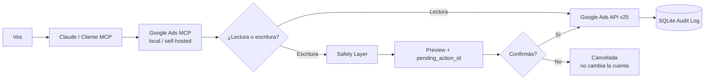

<div align="center">

## 🌐 Elegí tu idioma / Choose your language

[**🇦🇷🇪🇸 Español**](README.md) · [**🇬🇧🇺🇸 English**](README.en.md)

<br>


# Google Ads MCP

### Administrá Google Ads desde Claude — no sólo lo mires.

**Servidor MCP read/write para Google Ads API v25, self-hosted, con confirmación humana, auditoría, aislamiento MCC y acciones pendientes durables.**

Creado y mantenido por **[Alejandro José · Akela](https://github.com/akelaonline)**

[](docs/RELEASE_0.16.8.md)
[](docs/RELEASE_0.16.8.md)
[](https://developers.google.com/google-ads/api)
[](pyproject.toml)
[](LICENSE)

[](https://marketingdigitalexperience.com)
[](https://mktmarketingdigital.com)
[](https://www.instagram.com/akelaonline/)
[](mailto:alejandro@mktmarketingdigital.com)

<br>

[Qué problema resuelve](#por-qué-existe) · [Cómo funciona](#cómo-funciona) · [Tutorial paso a paso](#tutorial-paso-a-paso) · [Ejemplos](#ejemplos-reales-de-uso) · [Seguridad](#seguridad-de-fábrica) · [Capacidades](#capacidades) · [Sobre Akela](#sobre-akela)

</div>

---

## Qué es

**Google Ads MCP** es un servidor [Model Context Protocol](https://modelcontextprotocol.io) que conecta Claude —o cualquier cliente MCP compatible— con la **Google Ads API v25** para trabajar sobre cuentas reales.

No está pensado como un dashboard más. Está pensado para hacer el trabajo cotidiano de una agencia o un equipo de performance desde una conversación:

- leer reportes y GAQL;
- encontrar desperdicio de presupuesto;
- crear y modificar campañas;
- administrar keywords, anuncios, assets y audiencias;
- trabajar con Conversiones, Customer Match, Performance Max y Experiments;
- operar varias cuentas desde una MCC;
- ejecutar cambios con **human-in-the-loop** en vez de darle a la IA permiso ciego sobre el gasto.

Todo corre en tu infraestructura. Tus credenciales de Google Ads no necesitan pasar por un SaaS intermediario.

---

## Por qué existe

Leer datos desde una IA es útil. **Operar una cuenta es otra cosa.**

El trabajo real de performance incluye decisiones como:

> “Mostrame los términos de búsqueda de los últimos 7 días, detectá los que gastaron y no convirtieron, proponé negativas y no publiques nada hasta que yo lo confirme.”

O:

> “Revisá la campaña de Search, encontrá qué grupo perdió volumen por presupuesto, compará CPA y proponeme el cambio más razonable.”

O:

> “Creá la estructura de una campaña nueva, dejala PAUSED y mostrámela antes de tocar delivery.”

Google Ads MCP cierra esa distancia entre **analizar** y **hacer**, sin eliminar el control humano.

### Diseñado para agencias y operadores

| Necesidad | Qué aporta este MCP |
|---|---|
| Muchas cuentas | MCC + allowlist + aislamiento entre customers |
| Optimización diaria | Reportes → decisión → acción dentro de la misma conversación |
| Cambios delicados | `propose → preview → confirm → execute → audit` |
| Auditoría | SQLite local con historial y action IDs |
| Reinicios | Acciones pendientes durables y cifradas |
| Reporting-only | Kill switch `GOOGLE_ADS_MCP_READ_ONLY=true` |
| Integración con IA | Claude Desktop, Claude Code o cualquier cliente MCP compatible |

---

## Cómo funciona


```mermaid
flowchart LR
    U[Vos] --> C[Claude / Cliente MCP]
    C --> M[Google Ads MCP\nlocal / self-hosted]
    M --> R{¿Lectura o escritura?}
    R -->|Lectura| G[Google Ads API v25]
    R -->|Escritura| S[Safety Layer]
    S --> P[Preview + pending_action_id]
    P --> H{Confirmás?}
    H -->|No| X[Cancelada\nno cambia la cuenta]
    H -->|Sí| G
    G --> A[(SQLite Audit Log)]
```

### Una escritura normal

```text
proponer → previsualizar → confirmar → ejecutar → auditar
```

La IA puede preparar el cambio. **Vos decidís cuándo se ejecuta.**

---

## Ejemplos reales de uso

### 1. Search Terms → negativas

```text
Vos:
Revisá los términos de búsqueda de los últimos 7 días.
Todo lo que gastó más de USD 20 y tuvo 0 conversiones,
proponelo como negativa. No confirmes nada.

Claude:
→ get_search_terms_report(...)
→ add_negative_keywords(...)

Propuesta:
- free
- jobs
- diy
- template

pending_action_id: 7f3a2c1e
Nada cambió todavía.

Vos:
Confirmá 7f3a2c1e.

Claude:
→ confirm_pending_action("7f3a2c1e")
✓ Cambio aplicado y registrado en audit.db
```

### 2. Auditoría de una cuenta

```text
Analizá esta cuenta durante los últimos 30 días.
Separame campañas por CPA, ROAS, gasto y pérdida de impression share.
No hagas cambios. Dame primero 5 prioridades.
```

### 3. Crear sin publicar

```text
Prepará una campaña Search para este servicio.
Creá presupuesto, campaña, grupo, keywords y RSA,
pero dejá todo PAUSED y pedime confirmación antes de cada escritura.
```

### 4. MCC

```text
Listá las cuentas permitidas de mi MCC y mostrámelas ordenadas por gasto de los últimos 7 días.
```

Más ejemplos listos para usar: [`docs/EXAMPLES.md`](docs/EXAMPLES.md).

---

# Tutorial paso a paso

## Paso 0 — Requisitos

Necesitás:

- Python **3.11+**;
- acceso a una cuenta Google Ads;
- **Developer Token** de Google Ads;
- OAuth 2.0 Client ID / Client Secret;
- Refresh Token con scope de Google Ads;
- opcionalmente un **Login Customer ID** si trabajás con MCC.

La guía detallada de credenciales está en [`docs/SETUP.md`](docs/SETUP.md).

## Paso 1 — Clonar e instalar

```bash
git clone https://github.com/akelaonline/MCP-Google-Ads.git
cd MCP-Google-Ads

python -m venv .venv
source .venv/bin/activate
python -m pip install --upgrade pip
pip install -e ".[dev]"
```

En Windows PowerShell:

```powershell
.venv\Scripts\Activate.ps1
```

## Paso 2 — Crear tu `.env`

```bash
cp .env.example .env
```

Completá como mínimo:

```dotenv
GOOGLE_ADS_DEVELOPER_TOKEN=
GOOGLE_ADS_CLIENT_ID=
GOOGLE_ADS_CLIENT_SECRET=
GOOGLE_ADS_REFRESH_TOKEN=
GOOGLE_ADS_LOGIN_CUSTOMER_ID=
```

Para producción con varias cuentas, agregá una allowlist explícita:

```dotenv
GOOGLE_ADS_MCP_ALLOWED_CUSTOMER_IDS=123-456-7890,987-654-3210
GOOGLE_ADS_MCP_REQUIRE_CUSTOMER_ALLOWLIST=true
```

> **No subas `.env` a GitHub.**

## Paso 3 — Validar la instalación

Antes de abrir Claude:

```bash
python scripts/validate_local.py
```

La versión 0.16.8 debe terminar con:

```text
LOCAL VALIDATION GREEN
validated version: 0.16.8
```

El gate ejecuta smoke aislado + Ruff + pytest completo. La referencia actual es **346/346 tests**.

Si el import falla, verificá primero que estés usando el Python del venv:

```bash
.venv/bin/python -c "import google_ads_mcp; print(google_ads_mcp.__version__, google_ads_mcp.__file__)"
```

## Paso 4 — Conectarlo a Claude Desktop / Claude Code

Usá **la ruta absoluta al Python del venv**, no un `python` genérico:

```json
{
  "mcpServers": {
    "google-ads": {
      "command": "/ruta/absoluta/MCP-Google-Ads/.venv/bin/python",
      "args": ["-m", "google_ads_mcp.server"],
      "env": {
        "GOOGLE_ADS_MCP_ENV_FILE": "/ruta/absoluta/MCP-Google-Ads/.env"
      }
    }
  }
}
```

Reiniciá el cliente MCP después de cambiar la configuración.

Guía de clientes: [`docs/CLIENTS.md`](docs/CLIENTS.md).

## Paso 5 — Primera prueba: sólo lectura

La primera vez, arrancá conservador:

```dotenv
GOOGLE_ADS_MCP_READ_ONLY=true
```

Y preguntá:

```text
Listá mis customer IDs accesibles de Google Ads.
```

Después:

```text
Mostrame performance por campaña de los últimos 7 días.
```

Si eso funciona, ya verificaste conexión, OAuth y acceso a Google Ads sin permitir mutaciones.

## Paso 6 — Primera escritura segura

Cuando quieras probar escrituras:

```dotenv
GOOGLE_ADS_MCP_READ_ONLY=false
GOOGLE_ADS_MCP_AUTO_APPROVE=false
GOOGLE_ADS_MCP_AUTO_APPROVE_SPEND=false
GOOGLE_ADS_MCP_AUTO_APPROVE_DESTRUCTIVE=false
GOOGLE_ADS_MCP_AUTO_APPROVE_SENSITIVE=false
```

Pedile una modificación reversible:

```text
Proponé renombrar esta campaña de prueba.
No confirmes el cambio.
```

Esperá una respuesta con:

```text
status: pending_confirmation
pending_action_id: ...
```

Luego decidís:

```text
Confirmá <pending_action_id>
```

O:

```text
Cancelá <pending_action_id>
```

---

## Seguridad de fábrica

### Kill switch de sólo lectura

```dotenv
GOOGLE_ADS_MCP_READ_ONLY=true
```

Mantiene reporting, GAQL y auditoría, pero bloquea escrituras y confirmaciones.

### Aislamiento MCC / customers

Una misma credencial MCC puede alcanzar muchas cuentas. El servidor valida customer IDs y referencias de recursos antes de contactar Google.

También filtra las superficies jerárquicas:

- `customer_client`
- `customer_client_link`
- `customer_manager_link`

Y revisa referencias cross-customer incluso dentro de protobuf maps, `Struct`, listas y nested messages.

### Niveles de riesgo

| Clase | Ejemplos | Comportamiento recomendado |
|---|---|---|
| `standard` | preparación/administración sin delivery inmediato | confirmación humana |
| `spend` | presupuesto, puja, keywords, targeting, assets live | confirmación humana obligatoria |
| `destructive` | remove/unlink | confirmación humana obligatoria |
| `sensitive` | acceso, billing, Customer Match, links | confirmación humana obligatoria |

### Acciones pendientes durables

Las propuestas viven en SQLite y sus argumentos de replay se cifran con Fernet.

```dotenv
GOOGLE_ADS_MCP_PENDING_ENCRYPTION_KEY=<fernet-key>
```

Si la clave falta o está corrupta, el sistema **falla cerrado**: no ejecuta la mutación.

Más detalle: [`docs/SAFETY.md`](docs/SAFETY.md).

---

## Capacidades

| Área | Cobertura |
|---|---|
| **Cuentas y MCC** | discovery, jerarquía, vínculos manager/cliente, usuarios, roles, invitaciones |
| **Reporting** | campañas, ad groups, ads, keywords, search terms, dispositivos, geo, assets, audiencias, shopping, impression share, change history, GAQL |
| **Campañas** | Search, Standard Shopping, Performance Max, Demand Gen, App Campaigns, Dynamic Search Ads, Smart Campaigns |
| **Presupuestos y bidding** | budgets, Manual CPC, Max Clicks/Conversions/Value, Target CPA/ROAS/Impression Share, portfolio bidding |
| **Ads y assets** | RSA, Responsive Display, Demand Gen, imágenes, video, calls, sitelinks, callouts, snippets, promociones, WhatsApp, lead forms, price, location, app/deep link |
| **Keywords y targeting** | ciclo de vida, bids, match types, negativas, location/language/device/audience/topic, placements, schedules, tracking URLs |
| **Audiencias** | remarketing, UserList, Customer Match, Audience, CustomAudience, CustomInterest |
| **Conversiones y goals** | actions, offline/call/enhanced uploads, GDPR consent, adjustments, value rules, unified goals |
| **Performance Max** | campaign + asset groups + assets + signals + listing filters + previews |
| **Experiments** | lifecycle, arms, schedule, promote, graduate, end, traffic splits |
| **Batch / Smart Bidding** | Batch Jobs, seasonality adjustments, data exclusions |
| **Billing y links** | billing setup, invoices, account budgets, ProductLink, DataLink, YouTube/app analytics |
| **Planning / especialistas** | Keyword Planner, Reach Planner, Local Services, Identity, Incentives, SKAd visibility, YouTube upload |
| **Acceso restringido** | Audience Insights, Benchmarks, Creator Insights, Asset Generation closed beta |
| **Merchant Center** *(beta)* | estado de cuenta y diagnósticos, catálogo de productos + issues, altas/bajas de productos, feeds/datasources, reporting MCQL |

Cobertura exhaustiva v25: [`docs/V25_SERVICE_COVERAGE.md`](docs/V25_SERVICE_COVERAGE.md).

---

## Merchant Center (beta)

Además de Google Ads, el MCP puede hablar directo con **Merchant API** (el
reemplazo de Content API for Shopping, que Google discontinuó en agosto 2026):
estado de la cuenta, diagnóstico de productos rechazados/no elegibles, alta y
baja de productos, gestión de feeds (data sources) y reporting vía MCQL —
todo con el mismo modelo de propuesta/confirmación que el resto de las
escrituras.

- Reutiliza el mismo cliente OAuth de Google Ads: generá el refresh token con
  `python -m google_ads_mcp.auth --generate-refresh-token --include-merchant-center`
  (o seteá `GOOGLE_MERCHANT_CENTER_REFRESH_TOKEN` aparte si Merchant Center
  vive en otra cuenta de Google).
- Opcional: `GOOGLE_MERCHANT_CENTER_ID` como cuenta por defecto.
- Herramientas típicas: `list_merchant_center_product_issues` (productos
  rechazados/no elegibles y por qué), `get_merchant_center_product_performance`,
  `list_merchant_center_datasources`, `insert_merchant_center_product`,
  `remove_merchant_center_product`.

---

## Para agencias y consultores

Este proyecto nació para workflows donde **marketing, datos y operación tienen que ocurrir juntos**.

- Revisar una MCC sin saltar entre interfaces.
- Pasar de reporte a optimización en la misma conversación.
- Preparar campañas enteras y dejar todo PAUSED para revisión.
- Aplicar negativas desde Search Terms sin copiar/pegar.
- Investigar keywords con Keyword Planner desde Claude.
- Administrar conversiones, Customer Match, PMax y experiments.
- Tener trazabilidad de qué propuso la IA y qué aprobó una persona.

No reemplaza el criterio de un especialista. **Le da al especialista más palanca.**

---

## ¿Qué hace diferente a este proyecto?

| | Reporting | Gestión read/write | Human-in-the-loop | Audit local | MCC isolation | Self-hosted |
|---|:---:|:---:|:---:|:---:|:---:|:---:|
| **Google Ads MCP by Akela** | ✅ | ✅ | ✅ | ✅ | ✅ | ✅ |
| Servidores orientados sólo a reporting | ✅ | ❌ / parcial | — | — | variable | variable |
| Integradores SaaS genéricos | ✅ | variable | variable | remoto | variable | ❌ |

El objetivo no es “darle control total a una IA”. El objetivo es **darle herramientas reales a un operador humano asistido por IA**.

---

## Versión actual — 0.16.8

`0.16.8` es la versión recomendada.

- Google Ads API v25.
- Smoke aislado verde.
- Ruff limpio.
- **346/346 pytest**.
- Cero duplicate-tool warnings.
- Registro canónico de tools blindado por regresión.
- E2E real validado: read-only, aislamiento cross-customer, propose/cancel, propose/confirm y durable replay después de restart.

El detalle técnico, incluyendo el bug de registro corregido y los owners canónicos de Conversion Value Rules / PMax, vive en [`docs/RELEASE_0.16.8.md`](docs/RELEASE_0.16.8.md).

Historial completo: [`CHANGELOG.md`](CHANGELOG.md).

---

## Actualizar una instalación existente

No reemplaces tu `.env`, audit DB ni encryption key.

```bash
cd MCP-Google-Ads
git fetch origin
git pull --ff-only origin main
source .venv/bin/activate
python -m pip install -e ".[dev]"
python scripts/validate_local.py
```

Procedimiento completo: [`docs/UPDATE_LOCAL.md`](docs/UPDATE_LOCAL.md).

---

## Troubleshooting rápido

| Problema | Qué revisar primero |
|---|---|
| `ModuleNotFoundError: google_ads_mcp` | Claude está usando otro Python; apuntá a `.venv/bin/python` absoluto |
| No aparecen cuentas | OAuth / Developer Token / Login Customer ID |
| `USER_PERMISSION_DENIED` | permisos de la identidad OAuth y MCC correcto |
| Una escritura no ejecuta | probablemente está `pending_confirmation` — es el comportamiento esperado |
| Todo write da error read-only | revisar `GOOGLE_ADS_MCP_READ_ONLY=true` |
| Customer bloqueado | revisar allowlist; no la amplíes sin validar qué cuenta querés autorizar |
| Pending no sobrevive restart | persistir `audit.db` y la misma key Fernet |

Guía completa: [`docs/SETUP.md#troubleshooting`](docs/SETUP.md#troubleshooting).

---

## Documentación

| Documento | Para qué sirve |
|---|---|
| [`docs/SETUP.md`](docs/SETUP.md) | instalación, credenciales, OAuth, troubleshooting |
| [`docs/CLIENTS.md`](docs/CLIENTS.md) | Claude Desktop, Claude Code y otros clientes MCP |
| [`docs/TOOLS.md`](docs/TOOLS.md) | índice operativo de tools |
| [`docs/SAFETY.md`](docs/SAFETY.md) | confirmaciones, riesgos, aislamiento y auditoría |
| [`docs/EXAMPLES.md`](docs/EXAMPLES.md) | conversaciones y consultas listas para usar |
| [`docs/V25_SERVICE_COVERAGE.md`](docs/V25_SERVICE_COVERAGE.md) | cobertura servicio por servicio de API v25 |
| [`docs/VALIDATION_CHECKLIST.md`](docs/VALIDATION_CHECKLIST.md) | validación antes de producción |
| [`docs/RELEASE_0.16.8.md`](docs/RELEASE_0.16.8.md) | release actual |
| [`CHANGELOG.md`](CHANGELOG.md) | historial completo |
| [`docs/FAQ.md`](docs/FAQ.md) | preguntas frecuentes |

---

## Sobre Akela

<div align="center">

### Alejandro José · Akela

**AI Products · WordPress Engineering · SEO Automation · Marketing Technology**

Construyo software práctico donde se cruzan **IA, marketing, publicidad, analytics, automatización y operación real**.

[](https://marketingdigitalexperience.com)
[](https://mktmarketingdigital.com)
[](https://github.com/akelaonline)

**[Instagram @akelaonline](https://www.instagram.com/akelaonline/)** · **[alejandro@mktmarketingdigital.com](mailto:alejandro@mktmarketingdigital.com)**

> **Build useful things. Ship them. Learn from production.**

Si este proyecto te ahorra tiempo, una ⭐ al repo ayuda a que más gente lo encuentre.

</div>

---

## Scope

Este MCP cubre **Google Ads API**, no todos los productos adyacentes de Google.

- Merchant Center feed/catalog editing corresponde a Merchant API.
- Google Business Profile es otra superficie.
- Servicios beta/allowlisted siguen requiriendo elegibilidad de Google.
- `ReservationService` no es público y no se simula.

---

## Contribuir

Contribuciones y issues son bienvenidos: [`CONTRIBUTING.md`](CONTRIBUTING.md).

Regla principal: **ninguna write tool debe saltarse la safety layer**.

---

## Licencia

MIT © 2026 **Alejandro José · Akela**. Ver [`LICENSE`](LICENSE).
