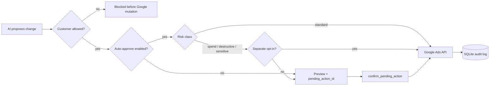

<div align="center">

# Google Ads MCP

**Production-oriented read/write Model Context Protocol server for operating Google Ads accounts from an AI client — with explicit confirmation, audit logging, customer isolation, and Google Ads API v25 contracts.**

Built by [**Akela**](https://github.com/akelaonline) — Google Ads automation & AI workflows

[](mailto:adjose@gmail.com)
[](https://www.instagram.com/akelaonline/)
[](LICENSE)
[](pyproject.toml)
[](https://developers.google.com/google-ads/api)
[](docs/RELEASE_0.16.0.md)

[Quick start](#quick-start) · [Coverage](#v016-coverage-completion) · [Capabilities](#capabilities) · [Safety](#safety-by-default) · [Documentation](#documentation)

</div>

---

## What this is

Most Google Ads MCP servers stop at reporting or raw GAQL. This project is designed to **operate** accounts: inspect performance, build and edit campaigns, change budgets and bidding, manage creatives, assets, audiences and first-party data, work with MCC/account administration, plan campaigns, upload conversions, run experiments, operate Performance Max and Demand Gen, and manage Google Ads recommendations.

Every normal write follows a **propose → preview → confirm → execute → audit** flow. The default configuration does not silently change live spend.

## v0.16 coverage completion

v0.16 closes the service-level Google Ads API v25 coverage pass.

The audited inventory contains **110 v25 service classes**:

- **102 stable-public services — supported**
- **5 Google-restricted / allowlisted services — explicitly classified**
- **2 beta / closed-beta services — explicitly classified**
- **1 not-public service — explicitly classified**
- **0 stable-public services marked missing**

This does **not** mean Google enables every capability for every advertiser. Account eligibility, developer-token access, product enrollment and Google allowlists still apply. The MCP distinguishes those Google-side capability boundaries from implementation gaps.

Final v0.16 closure includes:

- advertiser **Identity Verification** read/start workflows;
- **SKAdNetwork conversion-value schema** management;
- direct **UserDataService** Customer Match uploads with local SHA-256 hashing;
- **UserListCustomerType** lifecycle relationships;
- **BrandSuggestionService**;
- all ten documented campaign-construction types for `RecommendationService.GenerateRecommendations`;
- all six **ReachPlanService** RPC families, with explicit Google-allowlist handling;
- **IncentiveService** fetch/apply, with explicit Google-allowlist handling;
- contract guardrails for generated v25 request, operation, service and RPC names.

See [`docs/API_COVERAGE_V25.md`](docs/API_COVERAGE_V25.md) for the coverage contract and [`docs/RELEASE_0.16.0.md`](docs/RELEASE_0.16.0.md) for release notes.

## Capabilities

| Domain | Capabilities |
|---|---|
| **Accounts & MCC** | Accessible customers, account hierarchy, client creation, manager/client links, moves/unlinks, account settings, users, roles and invitations |
| **Billing & account budgets** | Payments accounts, billing setups, account-budget proposals/lifecycle and invoices |
| **Reporting** | Campaign, ad group, keyword, ad, search term, device, geography, asset, audience, shopping, change-history and raw GAQL reporting |
| **Campaigns** | Core campaign lifecycle, Search, Shopping, Demand Gen, Performance Max, campaign groups, drafts and experiments |
| **Budgets & bidding** | Daily/shared budgets, portfolio strategies, Manual CPC, Maximize strategies, Target CPA/ROAS/Impression Share, bid modifiers |
| **Smart Bidding controls** | Seasonality adjustments and conversion-data exclusions with channel/campaign/device scoping |
| **Ads & ad groups** | RSA, Responsive Display, Demand Gen image/video, creative edits, supported call replacement, status/bid administration |
| **Assets** | Text, image, call, promotion, callout, structured snippet, Business Message, asset sets and customer/campaign/ad-group relationships |
| **Performance Max** | Campaigns, complete asset groups, listing filters, signals, brand guidelines and shareable previews |
| **Keywords & negatives** | Keyword lifecycle, bids, match-type recreation, campaign/ad-group negatives, shared negative lists and batch operations |
| **Planning** | Keyword ideas, historical metrics, keyword forecasts, saved Keyword Plans, Reach Plan wrappers where Google grants access |
| **Audiences** | Remarketing, Customer Match, Audience/CustomAudience/CustomInterest, first-party data uploads and lifecycle customer types |
| **Conversions & goals** | Conversion actions, offline/enhanced uploads, adjustments, custom variables/goals, campaign/customer/lifecycle goals, value rules and SKAdNetwork |
| **Recommendations** | List, apply, dismiss, auto-apply subscriptions and all documented v25 campaign-construction generation types |
| **Batch operations** | Controlled asynchronous Batch Jobs with reviewed manifests and row-level result inspection |
| **Smart Campaigns** | Settings, serving status, budget/ad/keyword-theme suggestions and keyword-theme constants |
| **Product/data links** | Merchant/product links, invitations, DataLink and third-party app analytics links |
| **YouTube** | Demand Gen video assets, API video upload management and supported preview/link workflows |
| **Specialized services** | GoogleAdsField metadata, Brand/Travel suggestions, Local Services leads, Identity Verification and restricted Incentives |

Full tool signatures and operational notes live in [`docs/TOOLS.md`](docs/TOOLS.md).

## Safety by default


```mermaid
flowchart LR
    A[AI proposes change] --> S{Customer allowed?}
    S -- no --> X[Blocked before Google mutation]
    S -- yes --> B{Auto-approve enabled?}
    B -- no --> C[Preview + pending_action_id]
    B -- yes --> R{Risk class}
    R -- standard --> E[Google Ads API]
    R -- spend / destructive / sensitive --> H{Separate opt-in?}
    H -- no --> C
    H -- yes --> E
    C --> D[confirm_pending_action]
    D --> E
    E --> F[(SQLite audit log)]
```

Central risk classes are:

- `standard`
- `spend`
- `destructive`
- `sensitive`

With recommended production defaults, writes require confirmation. Even when global auto-approve is deliberately enabled, high-risk categories remain confirmation-gated unless their own opt-in is enabled.

v0.16 specifically treats direct first-party-data upload, advertiser identity verification, SKAdNetwork schema changes and incentive application as `sensitive`.

For customer-specific deployments:

```dotenv
GOOGLE_ADS_MCP_ALLOWED_CUSTOMER_IDS=123-456-7890
GOOGLE_ADS_MCP_REQUIRE_CUSTOMER_ALLOWLIST=true
GOOGLE_ADS_MCP_AUTO_APPROVE=false
GOOGLE_ADS_MCP_AUTO_APPROVE_SPEND=false
GOOGLE_ADS_MCP_AUTO_APPROVE_DESTRUCTIVE=false
GOOGLE_ADS_MCP_AUTO_APPROVE_SENSITIVE=false
```

See [`docs/SAFETY.md`](docs/SAFETY.md).

## Important Google-side capability boundaries

Some v25 services are not universally available even when OAuth and the developer token are otherwise valid.

- **ReachPlanService** — Google allowlist required.
- **IncentiveService** — Google allowlist required.
- **AudienceInsightsService, BenchmarksService, ContentCreatorInsightsService** — restricted access.
- **AssetGenerationService** — closed beta.
- **MultiPartyAuthReviewService** — beta.
- **ReservationService** — not publicly available.

The MCP does not label these conditions as implementation defects. See the coverage matrix for the exact classification.

## Quick start

```bash
git clone https://github.com/akelaonline/MCP-Google-Ads.git
cd MCP-Google-Ads
python -m venv .venv
source .venv/bin/activate
pip install -e .
cp .env.example .env
```

Configure credentials:

```dotenv
GOOGLE_ADS_DEVELOPER_TOKEN=
GOOGLE_ADS_CLIENT_ID=
GOOGLE_ADS_CLIENT_SECRET=
GOOGLE_ADS_REFRESH_TOKEN=
GOOGLE_ADS_LOGIN_CUSTOMER_ID=
```

Generate a refresh token if needed:

```bash
pip install -e ".[auth]"
python -m google_ads_mcp.auth --generate-refresh-token
```

Verify the package:

```bash
.venv/bin/python -c "import google_ads_mcp; print('OK', google_ads_mcp.__version__)"
```

Register with an MCP client using the virtualenv Python by absolute path:

```json
{
  "mcpServers": {
    "google-ads": {
      "command": "/absolute/path/to/MCP-Google-Ads/.venv/bin/python",
      "args": ["-m", "google_ads_mcp.server"],
      "env": {
        "GOOGLE_ADS_MCP_ENV_FILE": "/absolute/path/to/MCP-Google-Ads/.env"
      }
    }
  }
}
```

Then start with a read-only request such as:

> List my accessible Google Ads customer IDs.

Detailed credential/OAuth setup: [`docs/SETUP.md`](docs/SETUP.md).

## Example: report → proposal → confirmation

```text
User: Pull search terms for the last 7 days. Anything expensive with zero
      conversions, propose campaign negatives.

AI -> get_search_terms_report(...)
AI -> add_negative_keywords(...)
   <- pending_confirmation
      pending_action_id: 7f3a2c1e...
      nothing changed yet

User: confirm

AI -> confirm_pending_action("7f3a2c1e...")
   <- executed and recorded in the audit log
```

## HTTP transport

`stdio` is the default and recommended transport for local MCP clients.

The project blocks HTTP startup by default because write/confirmation tools are powerful and the server does not bundle a remote identity provider. If you deliberately deploy behind your own authenticated and restricted reverse proxy:

```dotenv
GOOGLE_ADS_MCP_TRANSPORT=http
GOOGLE_ADS_MCP_ALLOW_INSECURE_HTTP=true
```

Do not expose an unauthenticated instance to the public Internet.

## Adjacent-product boundaries

This MCP targets the **Google Ads API** plus the optional Google Data Manager integration already included in the project. It is not a replacement for every adjacent Google advertising product.

- Merchant Center catalog/feed administration remains outside the Google Ads service surface; linked retail campaigns can use the Ads-side product-link and PMax/Shopping workflows.
- Google Business Profile administration is a separate product surface.
- Obsolete Local Campaign / Smart Shopping creation is not emulated on retired shapes; use current supported campaign types.
- Legacy Call Ads use the supported RSA + Call Asset replacement.
- Legacy traditional `VIDEO` write paths are not fabricated; supported programmatic video uses Demand Gen / current YouTube asset flows.

## Validation

Install development dependencies and run locally:

```bash
pip install -e ".[dev]"
pytest tests/ -v
ruff check src tests scripts
```

The repository includes generated-client contract tests for protobuf-heavy Google Ads v25 paths, including the final v0.16 coverage additions. The v0.16 finalization itself intentionally did **not** consume GitHub Actions.

## Documentation

| Doc | Purpose |
|---|---|
| [`docs/API_COVERAGE_V25.md`](docs/API_COVERAGE_V25.md) | Audited v25 service coverage and Google-side restrictions |
| [`docs/RELEASE_0.16.0.md`](docs/RELEASE_0.16.0.md) | v0.16 release notes |
| [`CHANGELOG.md`](CHANGELOG.md) | Release history and migration notes |
| [`docs/SETUP.md`](docs/SETUP.md) | Google Cloud, OAuth, Developer Token, MCP config, troubleshooting |
| [`docs/TOOLS.md`](docs/TOOLS.md) | Tool signatures and operational notes |
| [`docs/SAFETY.md`](docs/SAFETY.md) | Customer isolation, risk-aware confirmation, retries, audit and HTTP safety |
| [`docs/EXAMPLES.md`](docs/EXAMPLES.md) | Example workflows and GAQL patterns |
| [`docs/FAQ.md`](docs/FAQ.md) | Common questions |

## Contributing

See [`CONTRIBUTING.md`](CONTRIBUTING.md). The non-negotiable rule for write tools is: **they must go through the safety layer**. Multi-resource operations that must succeed together should use the atomic mutation path.

## About Akela

I help agencies and consultants automate Google Ads workflows with AI — from MCC reporting to campaign builds, optimization, experiments, first-party data and custom MCP integrations.

- **Email:** [adjose@gmail.com](mailto:adjose@gmail.com)
- **Instagram:** [@akelaonline](https://www.instagram.com/akelaonline/)
- **GitHub:** [akelaonline](https://github.com/akelaonline)

If this saves you time, a ⭐ on the repo is appreciated.

## License

MIT © 2026 [Akela](https://github.com/akelaonline). See [LICENSE](LICENSE).
