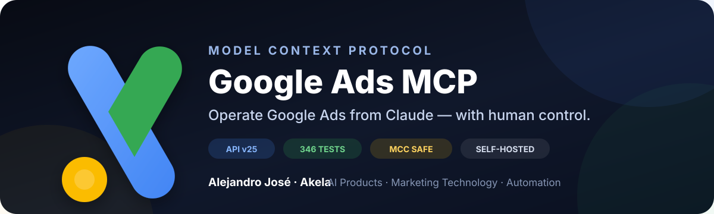

# v0.16.8 — Production-validated Google Ads MCP for Claude



**Operate Google Ads from Claude — don't just read it.**

Google Ads MCP 0.16.8 is the recommended production build of the v0.16 line: a self-hosted read/write MCP server for Google Ads API v25 with human confirmation, MCC isolation, durable pending actions, and local audit logging.

## Highlights

- ✅ **Google Ads API v25**
- ✅ **346/346 pytest**
- ✅ **Ruff clean**
- ✅ **Isolated smoke green**
- ✅ **Zero duplicate-tool warnings**
- ✅ **Real-account E2E validated**
- ✅ Read-only kill switch
- ✅ MCC / cross-customer isolation
- ✅ `propose → preview → confirm → execute → audit`
- ✅ Durable encrypted pending actions across restart
- ✅ Self-hosted; no required SaaS middleware

## What changed in 0.16.8

This release fixes a subtle registry bug where a newer implementation could be silently omitted when it competed for a public tool name that already had a canonical owner.

Only explicitly declared legacy modules may now be skipped silently. Any unexpected competing implementation fails server construction instead of disappearing without a trace.

### Conversion Value Rules

The typed implementation is now the default public tool:

```text
create_conversion_value_rule
  → google_ads_mcp.tools.conversions
```

The full protobuf-JSON variant remains available as:

```text
create_conversion_value_rule_from_json
```

The richer list/read path remains owned by:

```text
list_conversion_value_rules
  → google_ads_mcp.tools.remaining_core_services
```

## Validation

```text
isolated smoke  → SMOKE OK
ruff check      → All checks passed
pytest -q       → 346 passed
```

The release was also exercised against a real Google Ads MCC using reversible test operations:

- read-only mode;
- deliberate cross-customer isolation failure;
- propose/cancel;
- propose/confirm;
- audit action correlation;
- durable pending replay after MCP restart.

## Install

```bash
git clone https://github.com/akelaonline/MCP-Google-Ads.git
cd MCP-Google-Ads
python -m venv .venv
source .venv/bin/activate
python -m pip install --upgrade pip
pip install -e ".[dev]"
cp .env.example .env
```

Then follow the step-by-step tutorial in the README.

## Upgrade

Preserve your `.env`, audit DB and pending-action encryption key:

```bash
cd MCP-Google-Ads
git fetch origin
git pull --ff-only origin main
source .venv/bin/activate
python -m pip install -e ".[dev]"
python scripts/validate_local.py
```

Do not replace a working production deployment unless the local validator finishes green.

## Recommended production policy

```dotenv
GOOGLE_ADS_MCP_READ_ONLY=false
GOOGLE_ADS_MCP_AUTO_APPROVE=false
GOOGLE_ADS_MCP_AUTO_APPROVE_SPEND=false
GOOGLE_ADS_MCP_AUTO_APPROVE_DESTRUCTIVE=false
GOOGLE_ADS_MCP_AUTO_APPROVE_SENSITIVE=false
```

For the first boot after an upgrade, starting with `GOOGLE_ADS_MCP_READ_ONLY=true` is the conservative path.

## Documentation

- 🇦🇷🇪🇸 [README en Español](../README.md)
- 🇬🇧🇺🇸 [README in English](../README.en.md)
- [Full 0.16.8 technical release notes](RELEASE_0.16.8.md)
- [Setup](SETUP.md)
- [MCP clients](CLIENTS.md)
- [Safety model](SAFETY.md)
- [Examples](EXAMPLES.md)
- [Google Ads API v25 coverage](V25_SERVICE_COVERAGE.md)
- [Changelog](../CHANGELOG.md)

## Built by Akela

**Alejandro José · Akela** — AI Products · Marketing Technology · Automation

- [Marketing Digital Experience](https://marketingdigitalexperience.com)
- [MKT Marketing Digital](https://mktmarketingdigital.com)
- [GitHub](https://github.com/akelaonline)
- [Instagram @akelaonline](https://www.instagram.com/akelaonline/)
- [alejandro@mktmarketingdigital.com](mailto:alejandro@mktmarketingdigital.com)

> **Build useful things. Ship them. Learn from production.**

MIT License.
